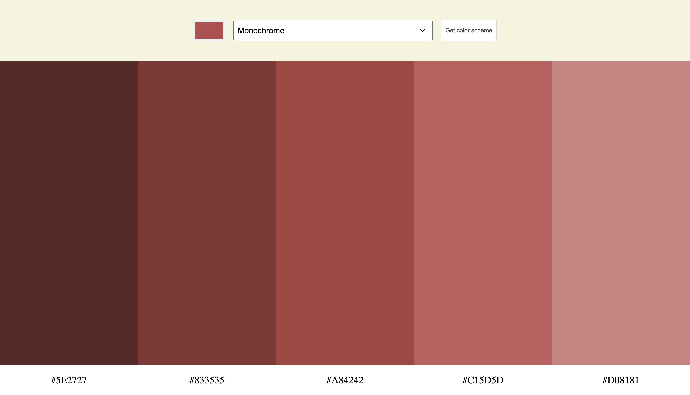

# Color Scheme Generator

Generate beautiful color palettes instantly using The Color API. Select a base color, choose a color harmony scheme, and generate a five-color palette complete with hex values that can be copied directly to your clipboard.

## Live Demo

[View Live Demo](https://shwarzbergzelda.github.io/Color-Scheme-Generator/)

## Screenshot



## Features

- 🎨 Choose any base color using a color picker
- 🌈 Generate color palettes using multiple harmony schemes:
  - Monochrome
  - Monochrome Dark
  - Monochrome Light
  - Analogic
  - Complement
  - Analogic Complement
  - Triad
  - Quad
- 📋 Click any hex code to copy it to your clipboard
- ⚡ Dynamically fetches color schemes using The Color API
- 📱 Responsive layout

## Built With

- HTML5
- CSS3
- JavaScript (ES6+)
- Fetch API
- The Color API

## How It Works

1. Select a base color using the color picker.
2. Choose a color scheme from the dropdown menu.
3. Click **Get color scheme**.
4. A five-color palette is generated.
5. Click any hex code to copy it to your clipboard.

## API Used

This project uses:

- https://www.thecolorapi.com/

Example request:

```javascript
fetch(
  `https://www.thecolorapi.com/scheme?hex=${hex}&mode=${scheme}&count=5`
)
```

## Installation

Clone the repository:

```bash
git clone https://github.com/shwarzbergzelda/Color-Scheme-Generator.git
```

Navigate to the project folder:

```bash
cd Color-Scheme-Generator
```

Open `index.html` in your browser or use a local development server.

## What I Learned

Through this project, I practiced:

- Working with external APIs using Fetch
- Handling form submissions with JavaScript
- Dynamically rendering HTML from API data
- Using CSS Grid for responsive layouts
- Implementing clipboard functionality with the Clipboard API
- Managing user interactions through event delegation

## Future Improvements

- Add copy confirmation notifications
- Save favorite color palettes
- Add support for exporting palettes
- Improve accessibility and keyboard navigation
- Add dark mode

## Author

**Zelda Shwarzberg**

GitHub: https://github.com/shwarzbergzelda
